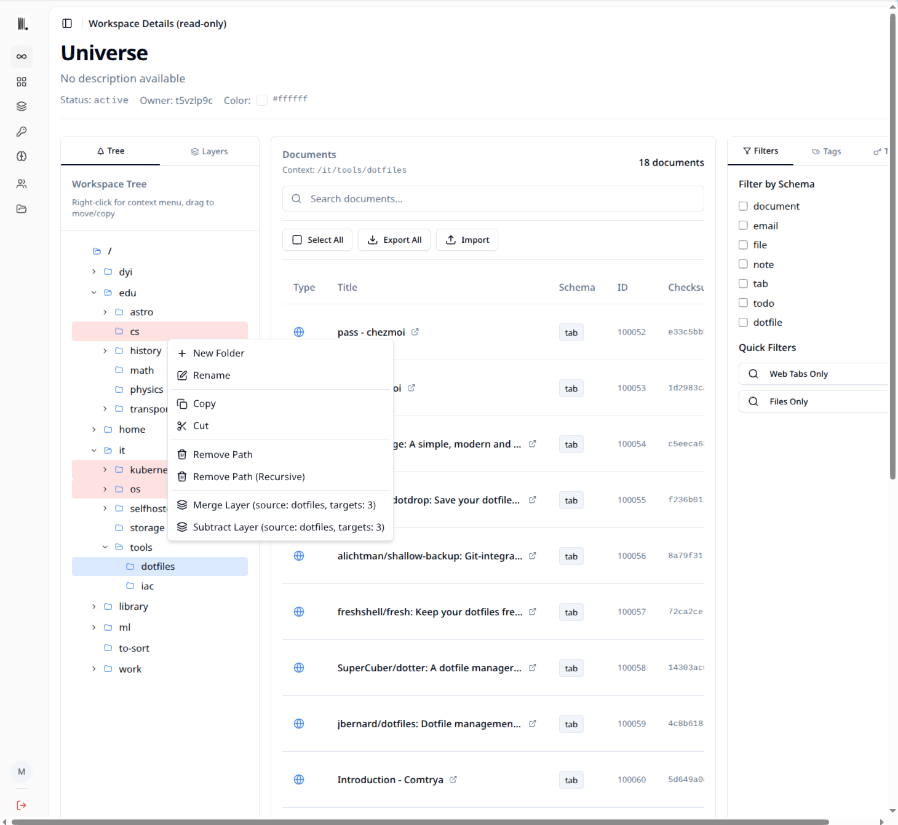

# Canvas web frontend

- Bundled with [Canvas Server](https://github.com/canvas-ai/canvas-server)  
- For standalone deployment, see the installation section below

## Screenshots

### Workspace Management


### Workspace Detail

Workspace connected to a browser running [canvas-browser-extension](https://github.com/canvas-ai/canvas-browser-extensions)


### Context detail

Context-bound browser with real-time data sync


## Installation (standalone)

### Prerequisites
- Node.js >= 20.0.0
- npm or yarn package manager

### Setup
1. **Clone this repository**
   ```bash
   git clone https://github.com/canvas-ai/canvas-web
   cd canvas-web
   ```

2. **Install dependencies**
   ```bash
   npm install
   ```

3. **Build the web frontend**
   ```bash
   npm run build
   ```

### Development
```bash
# Start development server
npm run dev

# Build for production
npm run build

# Preview production build
npm run preview

# Lint code
npm run lint
```

## Configuration

### Remote Access
```bash
# Copy environment template
cp .env.example .env

# Update Canvas Server API URL for remote access
VITE_API_URL=http://your-server:8001
```

### Environment Variables
| Variable | Default |
|----------|---------|
| `VITE_API_URL` | `http://localhost:8001` |
| `CANVAS_API_PORT` | `8001` |
| `CANVAS_API_HOST` | `0.0.0.0` | 
| `CANVAS_API_PROTOCOL` | `http` |

## License

Licensed under AGPL-3.0-or-later. See main project LICENSE file. 
